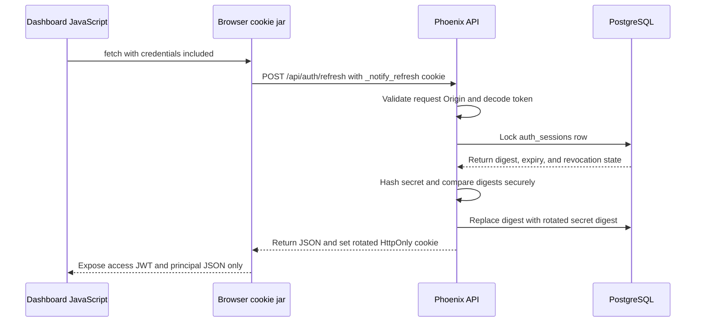

# Authentication Sessions

Notify dashboard authentication uses a short-lived access token and a
database-backed rotating refresh session. The API owns both credentials and
dashboard JavaScript never persists either credential in `localStorage` or
`sessionStorage`.

## Credential Model

- The access token is a signed JWT with a 15-minute lifetime. It contains only
  `sub` (user ID), `sid` (session ID), and `wid` (workspace ID). Dashboard
  JavaScript keeps it only in memory and sends it as an `Authorization: Bearer`
  header.
- The refresh token is an opaque session UUID plus a cryptographically random
  32-byte secret. The API stores only the SHA-256 digest of the secret.
- The raw refresh token is stored in the `_notify_refresh` cookie with
  `HttpOnly`, `SameSite=Lax`, and the `/api/auth` path. The cookie is also
  `Secure` in production.
- A session belongs to a workspace membership and records its expiry and
  optional revocation time in `auth_sessions`.

Roles are not authorization claims in the JWT. On protected requests, the API
loads the active membership referenced by the session and applies its current
database role. Membership removal therefore immediately revokes its sessions
and invalidates their access tokens.

The refresh session lasts one day by default or 30 days when the user selects
the remember option during login.

## Login

After credentials and email verification are accepted, the API:

1. Creates an `auth_sessions` row with the refresh-secret digest and expiry.
2. Issues an access JWT containing the user, workspace, and session IDs.
3. Sets the raw refresh token as an HttpOnly response cookie.
4. Returns the access token and authenticated principal in the JSON response.

The dashboard stores the access token, expiry, user, workspace, and role only
in the in-memory authentication client.

## Refresh And Rotation

The refresh endpoint performs these checks inside a database transaction:

1. Split the opaque token into its session UUID and Base64URL secret.
2. Validate the UUID and decode the secret.
3. Lock the matching session row with `FOR UPDATE` so concurrent refreshes
   cannot both rotate the same credential.
4. Reject a missing, expired, or revoked session.
5. Hash the supplied secret with SHA-256 and compare it with the stored digest
   using a constant-time comparison.
6. Generate a new random secret, replace the stored digest, issue a new access
   JWT, and set a rotated refresh cookie.

The dashboard also uses the Web Locks API and an in-process single-flight
promise so tabs do not intentionally race refresh requests.

## Workspace Switching

The selected workspace is always represented by a membership-scoped session.
Switching to another workspace creates a new session for that membership,
issues a new access JWT and refresh token, and rotates the browser cookie. The
previous workspace session is not reused as proof of access to the new one.
The switch is recorded as a workspace-scoped audit event without recording the
old or new credential material.

Each browser stores its last active workspace ID in local storage, keyed by
account; it never stores an access token, refresh token, or invitation
credential there. After sign-in, the browser restores that workspace through
the normal switch flow when the membership is still active. Otherwise it keeps
the API-selected fallback, which prefers the user's earliest active owner
membership and otherwise uses the earliest active membership.

## Invitation Acceptance

An invitation link carries a single-use token in `/auth/invitations/accept`.
The dashboard captures that token only long enough to call an acceptance API and
removes it from the URL immediately. It never writes invitation tokens to
browser storage.

- An authenticated user sends the token to `POST /api/auth/invitations/accept`.
  The API requires the user's confirmed normalized email to match the invitation,
  consumes the invitation and creates or reactivates the membership atomically,
  then returns a membership-scoped session for the invited workspace.
- A user without an account sends the token, password, password confirmation,
  workspace name, and accepted terms to `POST /api/auth/invitations/signup`.
  The API creates the confirmed user, a named owner workspace, the invited
  membership, session, and consumed invitation in one transaction. The session
  remains scoped to the invited workspace so acceptance lands in the expected
  context.

Both endpoints set the normal HttpOnly refresh cookie and require an allowed
dashboard origin. Invitation tokens are hashed at rest, expire, and remain
unconsumed if signup validation or persistence fails.
Invitation creation, revocation, and acceptance are recorded in the workspace
audit trail without storing the raw invitation token or its hash in metadata.

## Replay Protection

A refresh token can be used successfully only once. If an old token is used
after rotation, its digest no longer matches the database record. The API
revokes that session and returns `401 invalid_refresh_token`.

Revoking the session also invalidates access JWTs issued for it. Protected API
requests verify the JWT signature and then require the referenced session and
workspace membership to remain active in the database.

## Browser JavaScript Access

Dashboard JavaScript cannot read `_notify_refresh` through `document.cookie`
because the cookie is HttpOnly. It also cannot read the `Set-Cookie` response
header. The browser can still show the cookie to its owner through developer
tools.

JavaScript can initiate login, refresh, and logout requests with
`credentials: "include"`. The browser then attaches or updates the cookie
without exposing its value to the application. HttpOnly reduces refresh-token
theft through cross-site scripting, but it does not prevent malicious script
from issuing authenticated requests while it is executing. Notify therefore
also requires an allowed `Origin`, credentialed CORS, and `SameSite=Lax` for
cookie-backed authentication actions.

## Password Recovery

Password recovery uses two one-time credentials so the emailed token does not
remain in the address bar while the user chooses a new password:

Both stages are stored in `auth_challenges` as separate, purpose-scoped rows.
Only token digests are persisted. Password-reset verification and completion
rows reference the user, while signup rows use the normalized email because the
user does not exist yet.

1. `POST /api/auth/password-reset` accepts an email and always returns the same
   accepted response for a valid request shape. If the account exists, the API
   stores a digest of a random one-hour token and sends the raw token by email.
2. Opening `/auth/forgot-password?token=...` makes the hydrated dashboard call
   `POST /api/auth/password-reset/confirm`. The API consumes the email token and
   returns a 15-minute completion credential. The route then removes the raw
   token from the URL.
3. `POST /api/auth/password-reset/complete` accepts the completion credential,
   password, and password confirmation. The API validates the 8-to-72-character
   password, stores a new Argon2 hash, consumes the credential, and revokes all
   active sessions belonging to the user in one transaction.

Existing access JWTs stop working immediately because protected requests check
their database session. Other devices return to login on their next request or
refresh attempt. A successful reset does not automatically create a new session;
the user signs in with the new password.

Development reset emails are delivered to the local Mailpit inbox at
`http://localhost:8025` with the default `MAILPIT_UI_PORT`. The production
adapter remains disabled until a real email provider is configured.

## Logout

The current `DELETE /api/auth/session` endpoint revokes only the current
session. It uses the authenticated access token when available and falls back
to verifying the refresh cookie. The response clears the refresh cookie and is
idempotent.

Other devices remain signed in because each login has its own `auth_sessions`
row.

## Logout From All Devices

Logout from all devices is possible with the current database model, but it is
not implemented yet. A future authenticated endpoint should:

1. Require the current access token and an allowed dashboard origin.
2. Revoke every active `auth_sessions` row whose workspace membership belongs
   to the authenticated user.
3. Clear the current browser's refresh cookie.
4. Return `204 No Content` even when no other active sessions exist.

Revocation should update `revoked_at` instead of deleting session rows. Since
every protected request checks the referenced session, all issued access JWTs
would stop working immediately. Other devices would receive a `401` on their
next API request or refresh and return to the login page.

If multi-workspace membership is introduced, the product must choose whether
this action revokes sessions across the entire user account or only the current
workspace. The safer default for a control labelled "Log out all devices" is
account-wide revocation.

## Implementation References

- Session token encoding, hashing, comparison, and expiry:
  `apps/api/lib/api/accounts/auth_session.ex`
- Session rotation and access-token validation:
  `apps/api/lib/api/accounts.ex`
- Cookie flags, refresh endpoint, and logout endpoint:
  `apps/api/lib/api_web/controllers/auth_controller.ex`
- Browser credential transport: `apps/web/src/lib/api-client.ts`
- In-memory access-token lifecycle and cross-tab locking:
  `apps/web/src/lib/auth.tsx`
