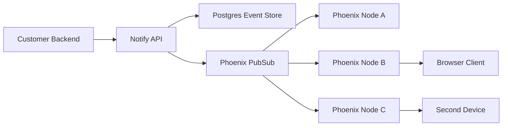

# Realtime Notification Architecture

This document describes the realtime notification architecture we want to align
the application toward. It focuses only on browser/client realtime delivery, not
email, SMS, mobile push, billing, or long-term notification analytics.

## Decision

Start with Phoenix Channels and topic-based PubSub routing.

Each socket server owns only the connections currently attached to that server.
The system does not need a central connection registry in v1. Instead, every
connected socket subscribes to a recipient-specific topic, and notification
publishers broadcast to that topic. Phoenix PubSub routes the message to the node that has the local subscriber.

## Core Problem

WebSocket connections are persistent. Once a client connects to a socket server,
that connection lives in memory on that specific server instance.

When we scale socket servers horizontally:

- API instance A may receive a notification event.
- socket server B may own the recipient connection.
- socket server C may own another device for the same recipient.
- API instance A should not need to know which socket server owns each connection.

The architecture must let any producer publish a notification while the realtime
layer delivers it only to connected clients that subscribed to the matching
recipient topic.

## V1 Architecture



In v1, the API and realtime socket endpoint can live in the same Phoenix
application. We can split them later when operational pressure justifies it.

## Topic Model

Use topics that include tenant/application scope and recipient identity.

Recommended shape:

```text
tenant:{tenant_id}:recipient:{recipient_id}
```

If we introduce multiple customer applications under a tenant, use:

```text
tenant:{tenant_id}:app:{app_id}:recipient:{recipient_id}
```

Rules:

- Never let the client choose arbitrary tenant or recipient values.
- Derive tenant and recipient from authenticated socket claims.
- Keep topic names stable and boring.
- Do not put sensitive data in topic names.

## Connection Flow

1. Client connects to the Phoenix socket endpoint.
2. Client presents an auth token or signed connection token.
3. Socket authentication resolves:
   - tenant id
   - optional app id
   - recipient id
   - session/device id
4. Socket joins the recipient notification channel.
5. The channel process subscribes to the matching PubSub topic.
6. The socket server keeps connection state in local memory only.

Example topic:

```text
tenant:t_123:recipient:user_456
```

## Publish Flow

1. Customer backend calls Notify API.
2. API authenticates the customer backend.
3. API validates tenant, recipient, payload, and idempotency key.
4. API stores the notification event in Postgres.
5. API broadcasts the notification to the recipient topic.
6. Phoenix PubSub forwards the message to nodes with subscribers.
7. Socket channel pushes the notification to connected clients.

The API does not need to know which socket node owns the recipient connection.

## Why PubSub First

Topic-based PubSub is the simplest scalable shape for our current stage.

Benefits:

- works naturally with Phoenix Channels
- avoids a central connection registry in v1
- supports multiple socket nodes
- supports multiple devices per recipient
- handles reconnects cleanly
- keeps API and realtime delivery loosely coupled

Tradeoff:

- every node in the PubSub cluster may receive some routing traffic
- at very high scale, this can become wasteful

That tradeoff is acceptable for v1. We should not start with registry-based
routing until the volume proves we need it.

## Load Balancing

WebSocket connections must stay pinned to the socket instance for the lifetime
of the TCP/WebSocket connection. This is normal WebSocket behavior.

Requirements:

- load balancer supports WebSocket upgrade
- idle timeout is longer than the heartbeat interval
- Phoenix heartbeat interval is configured intentionally
- proxy forwards client IP headers
- TLS terminates at the edge or at the load balancer

Sticky reconnects are not required. If a client reconnects to a different node,
that node authenticates the socket and subscribes to the same recipient topic.

## Clustering And PubSub Adapters

Development:

- single Phoenix node
- local Phoenix PubSub

Early production:

- multiple Phoenix nodes
- Phoenix PubSub across clustered BEAM nodes
- DNS-based clustering with `dns_cluster` or `libcluster`

Possible later adapters:

- Redis Pub/Sub when direct BEAM clustering is operationally awkward
- NATS when we need stronger broker semantics, clearer service boundaries, or
  non-Elixir consumers

Kafka is not the first choice for low-latency socket fanout. It may become
useful later for durable notification event streams, analytics, or replay.

## Delivery Semantics

Realtime socket delivery is best-effort in v1.

The durable record is the notification event stored in Postgres. If a recipient
is offline, the event remains available for later API fetches or inbox views.

V1 delivery expectations:

- online clients receive notifications over WebSocket
- offline clients do not require realtime delivery
- clients should be able to fetch recent notifications after reconnect
- notification events should include stable ids for de-duplication
- publishing should use an idempotency key from customer backends

Future delivery expectations:

- per-recipient unread counters
- replay cursor on reconnect
- delivery receipts
- per-device acknowledgement

## Backpressure

Socket delivery must not let one slow client harm the whole node.

Initial rules:

- keep payloads small
- send notification summaries over the socket
- let clients fetch heavy details through HTTP
- rate-limit customer backend ingest
- cap per-recipient burst fanout
- disconnect or degrade slow clients when needed

Future work:

- per-tenant quotas
- per-recipient queues
- dead letter handling for failed async deliveries
- adaptive throttling when socket nodes are saturated

## Security

Realtime socket auth must be treated as first-class API auth.

Rules:

- authenticate socket connections before joining notification topics
- authorize every channel join
- derive topic identity from verified claims
- reject cross-tenant recipient subscriptions
- use short-lived socket tokens
- rotate signing secrets safely
- avoid leaking sensitive data in socket payloads

Payloads should contain only what the client needs to render a notification.
Sensitive or large data should be fetched from authenticated HTTP endpoints.

## Observability

Track these metrics from the beginning:

- active socket connections
- connections per tenant
- joins and leaves per topic
- PubSub broadcast count
- socket push count
- socket push latency
- dropped/disconnected clients
- channel auth failures
- notification ingest count
- notification publish failures

Useful logs:

- socket connect/disconnect with tenant and recipient ids
- channel join rejection reason
- notification event id and recipient topic on publish
- PubSub delivery errors

Useful dashboards:

- active connections over time
- notifications per second
- publish-to-push latency
- error rate by tenant
- socket node memory and reductions

## Scaling Path

### Stage 1: Single Phoenix App

```text
API + WebSocket + local PubSub + Postgres
```

Use this while product surface is still small.

### Stage 2: Multiple Phoenix Nodes

```text
API + WebSocket on every node
Phoenix PubSub across clustered nodes
Postgres
```

Use this when one node is no longer enough for connection count or request
volume.

### Stage 3: Separate Realtime Gateway

```text
API service
Realtime gateway service
Shared PubSub or broker
Postgres
```

Use this when API load and socket connection load need independent scaling.

### Stage 4: Connection Registry And Targeted Routing

```text
recipient -> node/session registry
targeted per-node publish topics
shared broker
```

Use this when broadcast PubSub traffic becomes too expensive.

The registry should support:

- multiple devices per recipient
- TTL cleanup
- heartbeat refresh
- node drain handling
- reconnect races

Do not build this in v1.

## Alternatives Considered

### Broadcast To All Socket Nodes

This is the v1 recommendation through PubSub topics. It is simple and works well
with Phoenix.

### Central Connection Registry

Useful later, but too much operational complexity for v1. Requires accurate
heartbeats, TTLs, cleanup, and multi-device handling.

### Consistent Hashing Recipient Ownership

Efficient at massive scale, but hard to operate with autoscaling and reconnects.
Not recommended until the product has proven traffic patterns.

### API Directly Calling Socket Servers

Not recommended. It couples API ingress to connection ownership and creates
fragile routing logic.

## Open Questions

- Should v1 support only WebSocket, or WebSocket plus SSE?
- What is the initial socket authentication token format?
- Where will tenant and recipient ids come from in the first API contract?
- What is the first durable inbox/replay API shape?
- Should unread counters be part of realtime v1 or a later iteration?
- Which production platform will host Phoenix nodes and clustering?

## Recommendation

Build realtime v1 as:

```text
Phoenix API + Channels
Postgres event store
Phoenix PubSub recipient topics
WebSocket clients
```

Keep the connection ownership local to each socket node. Use PubSub topics to
route messages across nodes. Add a connection registry only after PubSub
broadcast traffic or per-node fanout becomes a measured scaling problem.
